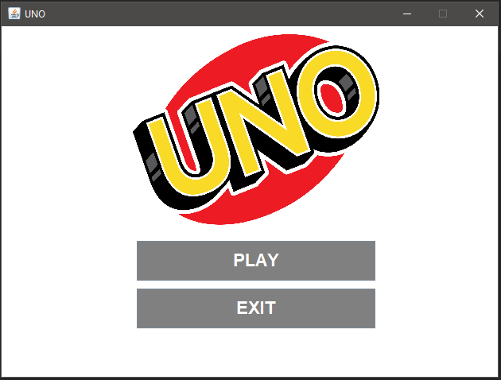

# UNO
UNO GUI w/ strategy AI. In this program I created a GUI where the user is able to play UNO with multiple bots. The program will loop through each player/bot turn until somone has gotten rid of all their cards. Once someone has won all the points will be tallied up and the players with less points will score higher on the leaderboard.

# Strategy AI
- High Amount of Cards
  - During the begining of the game while everyone still has a high amount of cards the strategy AI will prioritize getting rid of numerical cards that have a valid color or value. The valid numerical cards that we want to check for first are 0 cards since there rarer than any other numerical card. If there are no 0 cards than want to get the highest valued valid card. If a numerical card is not present than we want to start using a valid special card (reverse, draw 2, skip). If special cards are not present our last resort would be to use a wild card.
- Low Amount of Cards
  - When the game is about to reach an end and a player has a low amount of cards than we want our priorities switched. Once we see that a player has reached 3 or less cards than we want to start getting rid of our high value cards so that we can score higher on the leaderboard. The first card that we want to look for are wilds cards since they are worth 50 points. If there are no wild cards than than we want to look for special cards becuase they are worth 20 points. If those cards are not present than we want to look for the highest valued numerical card.

# Screenshots 
  

# What I Learned 
- Java Swing Framework
- Utilizing OOP Design Patterns
- Fetching and Displaying Images 
- Threading
- Implementing Callbacks 
